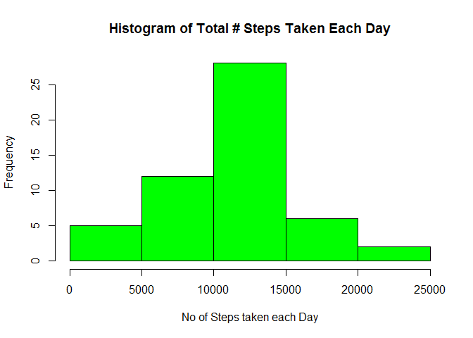
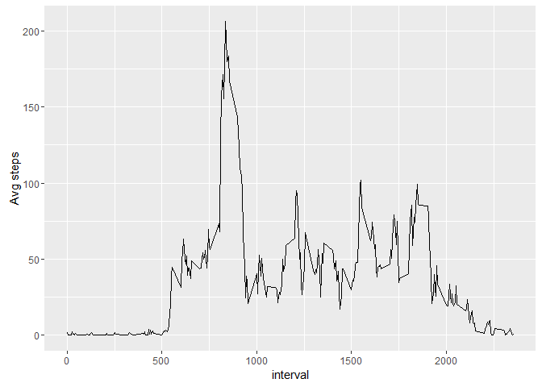
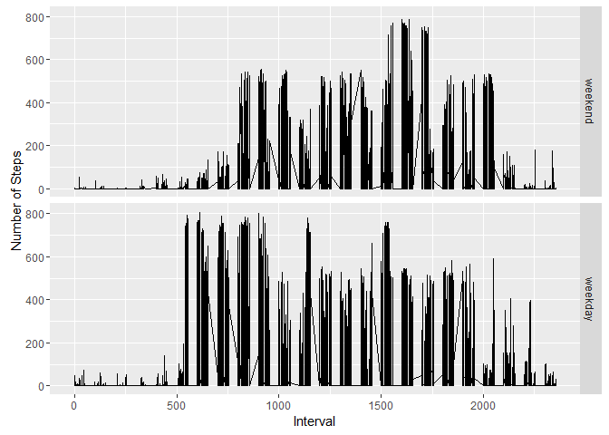

# PA1_template
Eday  
June 2, 2016  


## R Markdown

This is an R Markdown document. Markdown is a simple formatting syntax for authoring HTML, PDF, and MS Word documents. For more details on using R Markdown see <http://rmarkdown.rstudio.com>.

When you click the **Knit** button a document will be generated that includes both content as well as the output of any embedded R code chunks within the document. You can embed an R code chunk like this:
### 1. Code for reading in the dataset and/or processing the "Activity" data

```r
library(data.table)
library(plyr)
library(dplyr)
```

```
## 
## Attaching package: 'dplyr'
```

```
## The following objects are masked from 'package:plyr':
## 
##     arrange, count, desc, failwith, id, mutate, rename, summarise,
##     summarize
```

```
## The following objects are masked from 'package:data.table':
## 
##     between, last
```

```
## The following objects are masked from 'package:stats':
## 
##     filter, lag
```

```
## The following objects are masked from 'package:base':
## 
##     intersect, setdiff, setequal, union
```

```r
library(ggplot2)
setwd("C:\\Eday\\Doc\\R\\download")
dataset <- read.csv("activity.csv",colClasses = c("numeric","Date","numeric"))
```
### 1. a) Cleaning of Input dataset values

```r
dataset_complete <- subset(dataset, dataset$steps!='NA')
dataset_tab <- data.table(dataset_complete)
df1 <- ddply(dataset_tab, .(date), summarise, total_steps = sum(steps) , avg_steps=mean(steps),median_steps = median(steps))
df_avg_interval <- ddply(dataset_tab, .(interval), summarise, total_steps = sum(steps) , avg_steps=mean(steps),median_steps = median(steps))
```
## Including Plots

You can also embed plots, for example:

### 2. Histogram of the total number of steps taken each day

```r
hist(df1$total_steps,col = "green", xlab = "# of Steps Taken Each Day",
     ylab = "freq",main = "Histogram of Total # Steps Taken Each Day ")
```

<!-- -->
### 3. Mean  number of steps taken each day

```r
mean(df1$total_steps)
```

```
## [1] 10766.19
```

```r
median(df1$total_steps)
```

```
## [1] 10765
```
### 4. Time series plot of the average number of steps taken

```r
library(ggplot2)
ggplot(df_avg_interval, aes(interval, avg_steps)) + geom_line() + ylab("Avg steps")
```

<!-- -->
### 5. The 5-minute interval that, on average, contains the maximum number of steps

```r
interval_avg <- ddply(dataset_tab, .(interval), summarise, avg_int_steps = mean(steps))
max_steps <- which.max(interval_avg$avg_int_steps)
interval_avg[max_steps,]
```

```
##     interval avg_int_steps
## 104      835      206.1698
```
### 6. A  count of missing data 

```r
dataset_missing <- subset(dataset,is.na(dataset$steps))
count(dataset_missing)
```

```
## Source: local data frame [1 x 1]
## 
##       n
##   (int)
## 1  2304
```
### 6b.Strategy for imputing missing data ( Missing data filled with avg steps of each interval )

```r
interval_avg_sorted <- arrange(interval_avg,interval)
dataset_mis_input <- merge(dataset,interval_avg_sorted,by.x = "interval",by.y = "interval",all = TRUE)
dataset_mis_input$complete_step <- ifelse(is.na(dataset_mis_input$steps),   
                                          dataset_mis_input$avg_int_steps, dataset_mis_input$steps)
df_missing_filled <- ddply(dataset_mis_input, .(date), summarise, total_steps = sum(complete_step) , avg_steps=mean(complete_step),median_steps = median(complete_step))
weekdays1 <- c('Monday', 'Tuesday', 'Wednesday', 'Thursday', 'Friday')
dataset_mis_input$wday <- factor((weekdays(dataset_mis_input$date) %in% weekdays1), 
         levels=c(FALSE, TRUE), labels=c('weekend', 'weekday'))
head(dataset_mis_input,10)
```

```
##    interval steps       date avg_int_steps complete_step    wday
## 1         0    NA 2012-10-01      1.716981      1.716981 weekday
## 2         0     0 2012-11-23      1.716981      0.000000 weekday
## 3         0     0 2012-10-28      1.716981      0.000000 weekend
## 4         0     0 2012-11-06      1.716981      0.000000 weekday
## 5         0     0 2012-11-24      1.716981      0.000000 weekend
## 6         0     0 2012-11-15      1.716981      0.000000 weekday
## 7         0     0 2012-10-20      1.716981      0.000000 weekend
## 8         0     0 2012-11-16      1.716981      0.000000 weekday
## 9         0     0 2012-11-07      1.716981      0.000000 weekday
## 10        0     0 2012-11-25      1.716981      0.000000 weekend
```
### 7. Histogram of the total number of steps taken each day after missing values are imputed

```r
hist(df_missing_filled$total_steps,col = "green", xlab = "# of Steps Taken Each Day",
     ylab = "freq",main = "Histogram of Total # Steps Taken Each Day - filled missing values")
```

<!-- -->
### 8 .Panel plot comparing the avg no of steps taken per 5-min int across weekdays and Weekend 

```r
library(ggplot2)
ggplot(dataset_mis_input,aes(interval,complete_step)) + facet_grid(wday~.) +  geom_line() + labs(x="Interval",y="Number of Steps") 
```

<!-- -->

Note that the `echo = FALSE` parameter was added to the code chunk to prevent printing of the R code that generated the plot.
