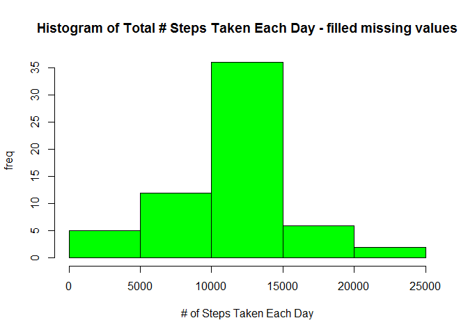

# PA1_template
Eday  
June 2, 2016  


## R Markdown

This is an R Markdown document. Markdown is a simple formatting syntax for authoring HTML, PDF, and MS Word documents. For more details on using R Markdown see <http://rmarkdown.rstudio.com>.

When you click the **Knit** button a document will be generated that includes both content as well as the output of any embedded R code chunks within the document. You can embed an R code chunk like this:
### 1. Code for reading in the dataset and/or processing the "Activity" data

```r
setwd("C:\\Eday\\Doc\\R\\download")
dataset <- read.csv("activity.csv",colClasses = c("numeric","Date","numeric"))
```
### 1. a) Cleaning of Input dataset values

```r
dataset_complete <- subset(dataset, dataset$steps!='NA')
dataset_tab <- data.table(dataset_complete)
df1 <- ddply(dataset_tab, .(date), summarise, total_steps = sum(steps) , avg_steps=mean(steps),median_steps = median(steps))
df_avg_interval <- ddply(dataset_tab, .(interval), summarise, total_steps = sum(steps) , avg_steps=mean(steps),median_steps = median(steps))
```
### 2. Histogram of the total number of steps taken each day

```r
hist(df1$total_steps,col = "green", xlab = "No of Steps taken each Day",
     ylab = "Frequency",main = "Histogram of Total # Steps Taken Each Day")
```

<!-- -->
### 3. Mean  number of steps taken each day

```r
mean(df1$avg_steps)    #37.3826
```

```
## [1] 37.3826
```

```r
median(df1$median_steps)  # 0 
```

```
## [1] 0
```
### 4. Time series plot of the average number of steps taken

```r
library(ggplot2)
ggplot(df_avg_interval, aes(interval, avg_steps)) + geom_line() + ylab("Avg steps")
```

<!-- -->
### 5. The 5-minute interval that, on average, contains the maximum number of steps

```r
interval_avg <- ddply(dataset_tab, .(interval), summarise, avg_int_steps = mean(steps))
max_steps <- which.max(interval_avg$avg_int_steps)
interval_avg[max_steps,]
```

```
##     interval avg_int_steps
## 104      835      206.1698
```
### 6. A  count of missing data 

```r
dataset_missing <- subset(dataset,is.na(dataset$steps))
count(dataset_missing)
```

```
## Source: local data frame [1 x 1]
## 
##       n
##   (int)
## 1  2304
```
### 6b.Strategy for imputing missing data ( Missing data filled with avg steps of each interval )

```r
interval_avg_sorted <- arrange(interval_avg,interval)
dataset_mis_input <- merge(dataset,interval_avg_sorted,by.x = "interval",by.y = "interval",all = TRUE)
dataset_mis_input$complete_step <- ifelse(is.na(dataset_mis_input$steps),   
                                          dataset_mis_input$avg_int_steps, dataset_mis_input$steps)
df_missing_filled <- ddply(dataset_mis_input, .(date), summarise, total_steps = sum(complete_step) , avg_steps=mean(complete_step),median_steps = median(complete_step))
weekdays1 <- c('Monday', 'Tuesday', 'Wednesday', 'Thursday', 'Friday')
dataset_mis_input$wday <- factor((weekdays(dataset_mis_input$date) %in% weekdays1), 
         levels=c(FALSE, TRUE), labels=c('weekend', 'weekday'))
mean(df_missing_filled$avg_steps)  # 10766.19
```

```
## [1] 37.3826
```

```r
median(df_missing_filled$median_steps)  # 10766.19
```

```
## [1] 0
```
### 6c . After imputting the Missing values  

```r
summary(df1)
```

```
##       date             total_steps      avg_steps        median_steps
##  Min.   :2012-10-02   Min.   :   41   Min.   : 0.1424   Min.   :0    
##  1st Qu.:2012-10-16   1st Qu.: 8841   1st Qu.:30.6979   1st Qu.:0    
##  Median :2012-10-29   Median :10765   Median :37.3785   Median :0    
##  Mean   :2012-10-30   Mean   :10766   Mean   :37.3826   Mean   :0    
##  3rd Qu.:2012-11-16   3rd Qu.:13294   3rd Qu.:46.1597   3rd Qu.:0    
##  Max.   :2012-11-29   Max.   :21194   Max.   :73.5903   Max.   :0
```

```r
summary(df_missing_filled)
```

```
##       date             total_steps      avg_steps        median_steps   
##  Min.   :2012-10-01   Min.   :   41   Min.   : 0.1424   Min.   : 0.000  
##  1st Qu.:2012-10-16   1st Qu.: 9819   1st Qu.:34.0938   1st Qu.: 0.000  
##  Median :2012-10-31   Median :10766   Median :37.3826   Median : 0.000  
##  Mean   :2012-10-31   Mean   :10766   Mean   :37.3826   Mean   : 4.474  
##  3rd Qu.:2012-11-15   3rd Qu.:12811   3rd Qu.:44.4826   3rd Qu.: 0.000  
##  Max.   :2012-11-30   Max.   :21194   Max.   :73.5903   Max.   :34.113
```
### Observations 
##### Median values are avaiable after imputting the values. 
##### Avg values are close to the values before imputting the missing.
##### Avg and Median values are same after imputtig the value 
### 7. Histogram of the total number of steps taken each day after missing values are imputed

```r
hist(df_missing_filled$total_steps,col = "green", xlab = "# of Steps Taken Each Day",
     ylab = "freq",main = "Histogram of Total # Steps Taken Each Day - filled missing values")
```

<!-- -->
### 8 .Panel plot comparing the avg no of steps taken per 5-min int across weekdays and Weekend 

```r
library(ggplot2)
ggplot(dataset_mis_input,aes(interval,complete_step)) + facet_grid(wday~.) +  geom_line() + labs(x="Interval",y="Number of Steps") 
```

<!-- -->

```r
#library(ezknitr)
#ezknit(file = "PA1_template.Rmd", out_dir = "", fig_dir = "figures-html")
```

Note that the `echo = FALSE` parameter was added to the code chunk to prevent printing of the R code that generated the plot.
